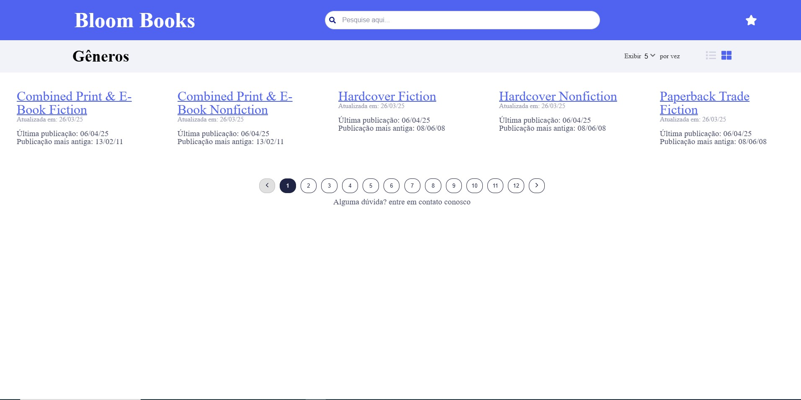
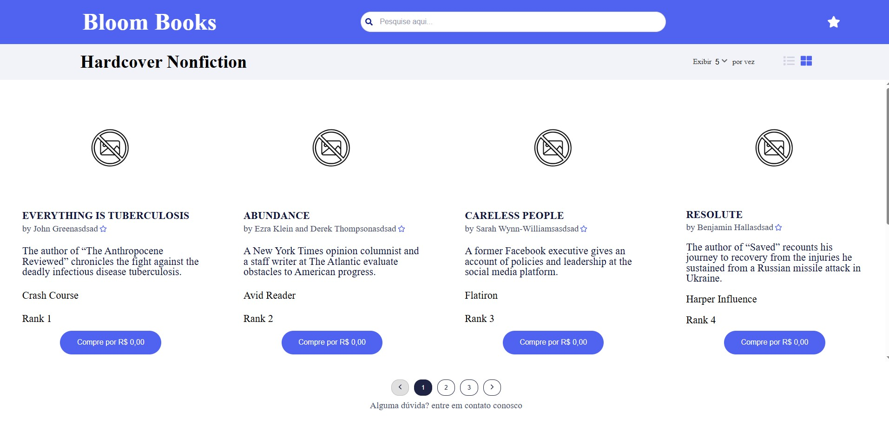
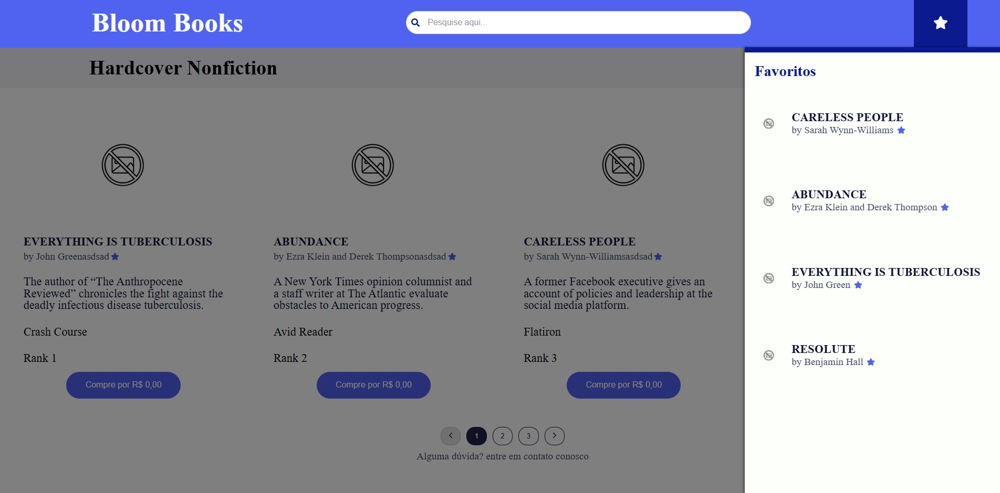

**BLOOM BOOKS**  Explore new worlds, one genre at a time.

<p align="center">
  <a rel="noopener" target="_blank"></a>
  <a rel="noopener" target="_blank"></a>
  <a rel="noopener" target="_blank"></a>
</p>

## Getting started

```sh
// use npm to install dependencies
npm install

// to run
npm run dev
```
Open [http://localhost:3000](http://localhost:3000) with your browser to see the result.

# About

This application provides a user-friendly interface to explore book genres and their respective bestsellers, powered by the New York Times API. Users can browse through a list of genres and select one to view the top-selling books in that category.
